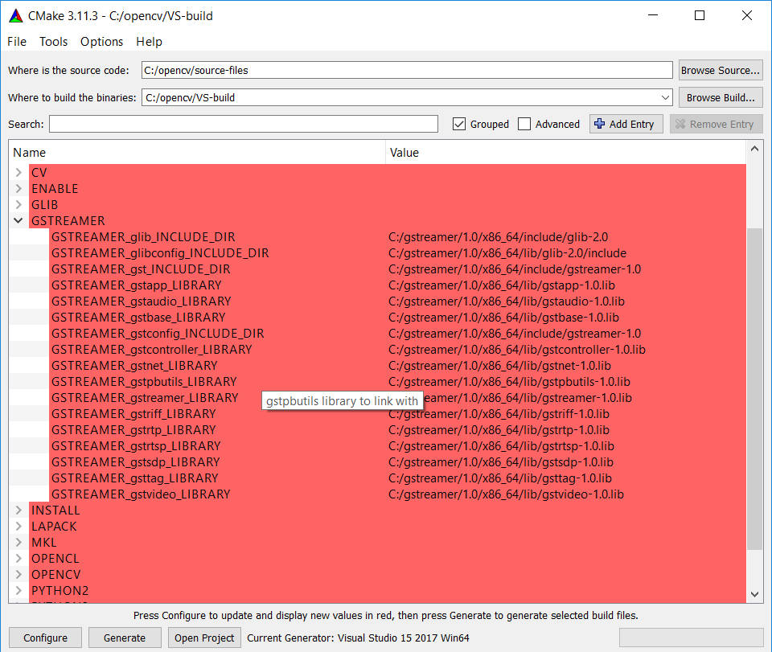

# OpenCV-GStreamer

**Release is available and contains the libraries already compiled.**

OpenCV and GStreamer compiled for Windows and ready to use in Visual Studio.

In this repository you can find OpenCV and GStreamer compiled together.


## Requirements

* [Visual Studio 2017](https://www.visualstudio.com/it/downloads/?rr=https%3A%2F%2Fwww.google.it%2F)
* [Git](https://git-scm.com/downloads)
* [CMake](https://cmake.org/download/)
* [GStreamer binary files](https://gstreamer.freedesktop.org/data/pkg/windows/)
* [OpenCV sources files](https://github.com/opencv/opencv)

## Instructions

* Install VisualStudio 2017

* Install CMake. During the installation add CMake to the system PATH for the current / all users.

* Install GStreamer and, during the installation, select checkbox *complete*.

* Insert new System Variable pointing to GStreamer installation folder: `GSTREAMER_DIR -> C:\gstreamer\1.0\x86_64`

* Insert in the System Variable *PATH* the folder that contains the GStreamer binary files, in my case `C:\gstreamer\1.0\x86_64\bin`

* Install Git

* Clone OpenCV repository and make checkout to branch called *3.4*

* Reboot system

* Open CMake:

  * set the folder that contains the OpenCV sources files;
  * set the folder to put the Visual Studio project;
  * press *Configure* button and choose Visual Studio 15 generator; 
  * make sure that CMake have found GStreamer libraries;
  * press again *Configure*;
  * press *Generate* button: now in destination folder there is a VS project to compile the libraries.

* Open with Visual Studio 2017 *OpenCV.sln*

* Buil the project **ALL_BUILD**

* Buil project **INSTALL** to put all files in a single directory called *install* 

  

  - Insert new System Variable pointing to OpenCV installation folder: `OPENCV_DIR-> C:\opencv\VS-build\install`
  - Insert in the System Variable *PATH* the folder that contains OpenCV binary files, in my case `C:\opencv\VS-build\install\x64\vc15\bin`
  - Reboot system.

  ## Test

  To test the library create new VS console project and insert the following dependencies:

  * `Directory di VC++ -> Directory di inclusione: C:\opencv\VS-build\install\include`
  * `Linker -> Generale -> Directory librerie aggiuntive: C:\opencv\VS-build\install\x64\vc15\lib`
  * `Linker -> Input -> Dipendenze aggiuntive: opencv_core341d.lib`

  At the end copy this code and run the application.

  ```c++
  #include "stdafx.h"
  #include <iostream>
  #include <opencv2/core/core.hpp>
  using namespace cv;
  int main()
  {
  	std::cout << cv::getBuildInformation() << std::endl;
      return 0;
  }
  ```

  

